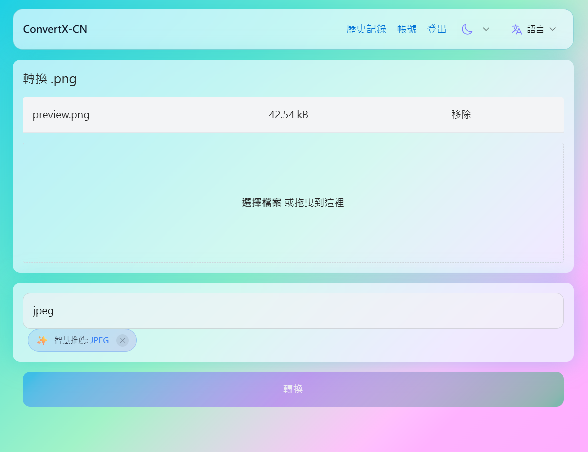

# ConvertX-CN

**開箱即用的全功能檔案轉換服務** — 一個 Docker 命令，5 分鐘部署完成

[](https://hub.docker.com/r/convertx/convertx-cn)
[](https://github.com/pi-docket/ConvertX-CN/releases)
[](LICENSE)
>)

---

## 為什麼選擇 ConvertX-CN？

| 特色              | 說明                                    |
| ----------------- | --------------------------------------- |
| 📁 **1000+ 格式** | 文件、圖片、影音、電子書一次搞定        |
| 🔧 **25+ 引擎**   | LibreOffice、FFmpeg、Pandoc 全到位      |
| 🈶 **中文優化**   | 內建中日韓字型與 OCR，告別亂碼          |
| 🌐 **65 種語言**  | 跨國團隊無障礙使用                      |
| 🎯 **智能推斷**   | 自動預測目標格式與引擎，越用越懂你      |
| 📊 **PDF 翻譯**   | PDFMathTranslate + BabelDOC 雙引擎      |
| 📄 **PDF 轉 MD**  | MinerU 智能擷取（保留表格、公式、圖片） |

---

## 📚 文件目錄

完整文件請參閱 **[專案總覽](docs/00-專案總覽.md)**

| 章節               | 說明                         | 連結                              |
| ------------------ | ---------------------------- | --------------------------------- |
| 📖 **00 專案總覽** | 專案定位、功能特色、版本比較 | [查看](docs/00-專案總覽.md)       |
| 🚀 **01 快速開始** | 5 分鐘部署完成               | [查看](docs/01-快速開始.md)       |
| 🐳 **02 部署指南** | Docker 設定、反向代理、HTTPS | [查看](docs/02-部署指南.md)       |
| ⚙️ **03 環境變數** | 所有可用設定與推薦值         | [查看](docs/03-環境變數與設定.md) |
| 🔌 **04 功能總覽** | 轉換器、OCR、PDF 翻譯        | [查看](docs/04-功能總覽.md)       |
| 🔗 **05 API 文件** | REST & GraphQL API           | [查看](docs/05-API文件.md)        |
| 🔧 **06 錯誤排查** | 常見問題與解決方案           | [查看](docs/06-錯誤排查與支援.md) |
| 👩‍💻 **07 開發指南** | 專案結構、貢獻規範           | [查看](docs/07-開發與貢獻指南.md) |
| 📄 **08 授權說明** | AGPL-3.0 授權                | [查看](docs/08-授權說明.md)       |

---

## 🚀 快速開始

### 步驟 1：建立 `.env` 檔案

> ⚠️ **必須先設定 `JWT_SECRET`**，這是系統運作的必要條件

```bash
mkdir -p ~/convertx-cn && cd ~/convertx-cn

# 產生 .env 檔案
cat > .env << 'EOF'
# JWT 密鑰（必須設定！建議 32+ 字元）
JWT_SECRET=你的隨機密鑰請更換成自己的字串

# 時區
TZ=Asia/Taipei

# ========== 進階設定（選填）==========

# MinerU 處理模式：pipeline（預設）或 vlm
# MINERU_MODE=pipeline

# BabelDOC 翻譯引擎：local（預設）、openai、deepseek、custom
# BABELDOC_ENGINE=local

# API Keys（如需使用 OpenAI/DeepSeek 翻譯）
# OPENAI_API_KEY=sk-...
# DEEPSEEK_API_KEY=sk-...
EOF

# 產生安全的 JWT_SECRET（擇一執行）
# Linux/macOS:
# sed -i "s/你的隨機密鑰請更換成自己的字串/$(openssl rand -base64 32)/" .env
# Windows PowerShell:
# (Get-Content .env) -replace '你的隨機密鑰請更換成自己的字串', [Convert]::ToBase64String((1..32 | ForEach-Object { Get-Random -Maximum 256 })) | Set-Content .env
```

### 步驟 2：Docker Compose（推薦）

```bash
# 建立資料目錄
mkdir -p data

# 建立 docker-compose.yml
cat > docker-compose.yml << 'EOF'
services:
  convertx:
    image: convertx/convertx-cn:latest
    container_name: convertx-cn
    restart: unless-stopped
    ports:
      - "3000:3000"
    volumes:
      - ./data:/app/data
    env_file:
      - .env
EOF

# 啟動服務
docker compose up -d
```

開啟瀏覽器：`http://localhost:3000`

### 或使用 Docker Run

```bash
docker run -d \
  --name convertx-cn \
  --restart unless-stopped \
  -p 3000:3000 \
  -v ./data:/app/data \
  --env-file .env \
  convertx/convertx-cn:latest
```

> 📖 詳細說明請參閱 [快速開始](docs/快速入門/快速開始.md)

---

## 🔗 線上示範

[](https://convertx-cn.bioailab.qzz.io)

<!-- [](https://convertx-cn.bioailab.qzz.io) -->

🔗 **https://convertx-cn.bioailab.qzz.io**

| 項目 | 內容              |
| ---- | ----------------- |
| 帳號 | admin@example.com |
| 密碼 | admin             |

### Lite 版（無需登入）

[](https://convertx-cn-lite.bioailab.qzz.io)

🔗 **https://convertx-cn-lite.bioailab.qzz.io**

直接使用，無需帳號密碼。

> ⚠️ 示範站僅供測試，請勿上傳敏感檔案，會定期清理資料。

---

## ⚡ 常見問題速查

| 問題               | 解決方法                                       |
| ------------------ | ---------------------------------------------- |
| 登入後被踢回登入頁 | 加上 `HTTP_ALLOWED=true` 或 `TRUST_PROXY=true` |
| 重啟後資料消失     | 確認 `./data:/app/data` 且資料夾存在           |
| 重啟後被登出       | 設定固定的 `JWT_SECRET`                        |

更多問題 → [FAQ](docs/快速入門/常見問題.md)

---

## 🐳 Docker vs Host 環境

### 為什麼推薦使用 Docker？

| 功能             | Docker 環境 | Host 環境（Debian/Ubuntu） |
| ---------------- | ----------- | -------------------------- |
| 基本轉檔         | ✅ 完整支援 | ✅ 需手動安裝依賴          |
| PDF 翻譯         | ✅ 完整支援 | ⚠️ 需額外設定              |
| MinerU VLM 模式  | ✅ 完整支援 | ❌ 需編譯 llama.cpp        |
| llama.cpp server | ✅ 自動啟動 | ⚠️ 需手動編譯與設定        |

### Host 環境常見問題

如果在 Host 環境（非 Docker）執行時看到以下錯誤：

```
llama-server: error while loading shared libraries: libmtmd.so.0
cannot open shared object file: No such file or directory
```

**這是因為：**

- `llama-server` 是 llama.cpp 編譯產生的執行檔
- `libmtmd.so` 是多模態支援的動態連結庫，需要與 llama-server 一起編譯
- Host 環境通常沒有這些預編譯的動態庫

**解決方案（擇一）：**

1. **使用 Docker（推薦）**

   ```bash
   docker pull convertx/convertx-cn:latest
   ```

2. **從源碼編譯 llama.cpp**

   ```bash
   git clone https://github.com/ggml-org/llama.cpp
   cd llama.cpp
   cmake -B build -DLLAMA_SERVER=ON
   cmake --build build
   # 複製執行檔和動態庫
   sudo cp build/bin/llama-server /usr/local/bin/
   sudo cp build/lib/*.so* /usr/local/lib/
   sudo ldconfig
   ```

3. **使用 pipeline 模式（不需要 llama-server）**
   ```bash
   MINERU_BACKEND=pipeline
   ```

> ℹ️ 系統會自動偵測 llama-server 的可用性，若無法啟動會自動回退到 pipeline 模式

---

## 📦 支援格式

| 轉換器           | 用途            | 格式數 |
| ---------------- | --------------- | ------ |
| FFmpeg           | 影音            | 400+   |
| ImageMagick      | 圖片            | 200+   |
| LibreOffice      | 文件            | 60+    |
| Pandoc           | 文件            | 100+   |
| Calibre          | 電子書          | 40+    |
| Inkscape         | 向量圖          | 20+    |
| PDFMathTranslate | PDF 翻譯        | 15+    |
| BabelDOC         | PDF 翻譯/轉換   | 15+    |
| MinerU           | PDF 轉 Markdown | 10+    |

完整列表 → [轉換器文件](docs/功能說明/轉換器.md)

---

## 🖼️ 預覽



---

## 🔄 更新

```bash
docker compose down
docker compose pull
docker compose up -d
```

---

## 🎯 版本選擇：Lite / 一般版 / Full

ConvertX-CN 提供三個版本，滿足不同需求：

| 特性              | Lite 版                                                                                                                              | 一般版（推薦）                                                                                                   | Full 版      |
| ----------------- | ------------------------------------------------------------------------------------------------------------------------------------ | ---------------------------------------------------------------------------------------------------------------- | ------------ |
| **Image 大小**    | >) |  | 約 12-15+ GB |
| **部署速度**      | 最快                                                                                                                                 | 中等                                                                                                             | 較慢         |
| **適用對象**      | 輕量使用者                                                                                                                           | 一般使用者                                                                                                       | 進階/多語言  |
| **基本轉檔**      | ✅                                                                                                                                   | ✅                                                                                                               | ✅           |
| **OCR（7語言）**  | ❌                                                                                                                                   | ✅                                                                                                               | ✅           |
| **PDF 翻譯**      | ❌                                                                                                                                   | ✅                                                                                                               | ✅           |
| **MinerU AI**     | ❌                                                                                                                                   | ✅                                                                                                               | ✅           |
| **OCR（65語言）** | ❌                                                                                                                                   | ❌                                                                                                               | ✅           |
| **完整 TexLive**  | ❌                                                                                                                                   | ❌                                                                                                               | ✅           |

### 版本標籤

| Tag           | 說明              |
| ------------- | ----------------- |
| `latest`      | 一般版最新穩定版  |
| `latest-lite` | Lite 版最新穩定版 |
| `0.1.22`      | 一般版指定版本    |
| `0.1.22-lite` | Lite 版指定版本   |

### Lite 版快速啟動

```bash
# 1. 建立 .env
mkdir -p ~/convertx-lite && cd ~/convertx-lite
cat > .env << 'EOF'
JWT_SECRET=你的隨機密鑰請更換成自己的字串
TZ=Asia/Taipei
ALLOW_UNAUTHENTICATED=true
EOF

# 2. 建立資料目錄並啟動
mkdir -p data
docker run -d \
  --name convertx-cn-lite \
  -p 3000:3000 \
  -v ./data:/app/data \
  --env-file .env \
  convertx/convertx-cn:latest-lite
```

> 📖 詳細說明請參閱 [部署指南](docs/02-部署指南.md)

---

<!-- ## 📈 Docker Adoption History

##  -->

## 🙏 致謝

本專案基於 [C4illin/ConvertX](https://github.com/C4illin/ConvertX) 開發，感謝原作者的貢獻。
