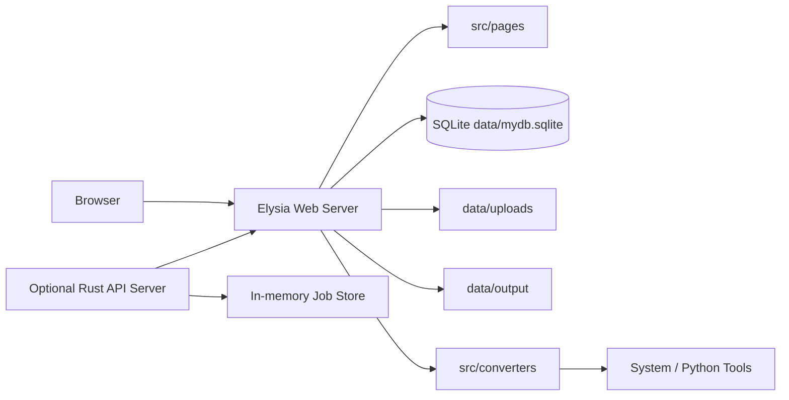
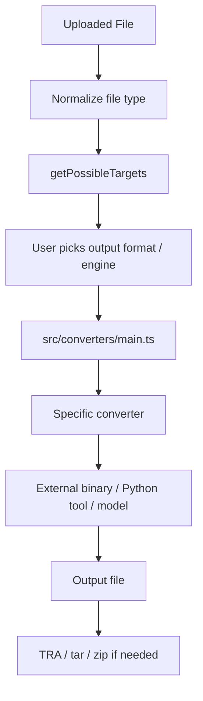
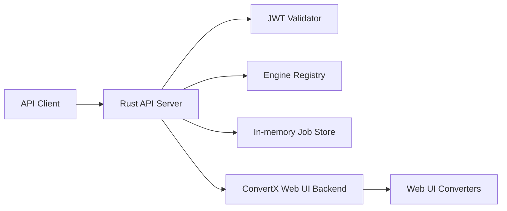

# 架构说明

> 文件目的：帮助开发者理解 ConvertX-CN 的模块关系、数据流与安全边界。
> 适合读者：维护者、贡献者、API 集成者。
> 最后更新依据：`src/index.tsx`、`src/converters/`、`src/db/`、`src/helpers/`、`src/i18n/`、`src/pages/`、`src/transfer/`、`api-server/src/`、`compose.yaml`、`Dockerfile*`。
> 相关文件：[开发指南](development.md)、[API Server](api-server.md)、[部署指南](deployment.md)

## 目录

- [系统总览](#系统总览)
- [Web UI / Web Server](#web-ui--web-server)
- [转换器架构](#转换器架构)
- [上传与转换流程](#上传与转换流程)
- [数据储存](#数据储存)
- [用户与登录](#用户与登录)
- [i18n 与主题](#i18n-与主题)
- [API Server](#api-server)
- [Docker 版本差异](#docker-版本差异)
- [安全边界](#安全边界)

## 系统总览

## Web UI / Web Server

入口是 `src/index.tsx`。它组合：

- static assets：`public/`
- HTML rendering：`@elysiajs/html`
- 用户、上传、转换、下载、历史、结果、健康检查等页面 route
- inference、engines、converters、RAS、memory diagnostics API

## 转换器架构

`src/converters/main.ts` 聚合所有 converter，并暴露：

- `handleConvert`
- `getPossibleTargets`
- `getAllTargets`
- `getAllInputs`
- `getDisabledEngines`

每个 converter 通常提供：

- `properties.from`
- `properties.to`
- `convert(...)`

## 上传与转换流程

1. 用户上传文件到 `data/uploads`。
2. Web UI 建立 job 与 file_names 记录。
3. `handleConvert` 根据 converter 和目标格式调用具体转换器。
4. 输出写入 `data/output`。
5. 多输出任务可能经 `src/transfer/` 打包。
6. 用户在结果页下载。

## 数据储存

`src/db/db.ts` 使用 Bun SQLite：

- 数据库路径：`./data/mydb.sqlite`
- 表：`users`、`file_names`、`jobs`、`api_keys`
- WAL mode：启用

注意：`.env.example` 中有 `DATA_DIR`，但当前数据库路径硬编码为 `./data/mydb.sqlite`，需标注待确认。

## 用户与登录

用户相关逻辑在 `src/pages/user.tsx`。`JWT_SECRET` 用于 JWT/Cookie。未设置时 Web UI 会随机生成 secret，导致重启后旧 session 失效。

## i18n 与主题

`src/i18n/index.ts` 导入大量 `src/locales/*.json`。当前 default locale 为 `zh-CN`，fallback 为 `en`。主题和前端脚本位于：

- `src/theme/`
- `public/theme.js`
- `public/i18n.js`
- `src/components/`

## API Server

API Server 是可选服务。它当前代理 Web UI backend，而不是完全独立执行转换。

## Docker 版本差异

- `Dockerfile.lite`：较轻量，安装常见工具。
- `Dockerfile`：Standard，包含系统工具、Python 工具、模型与 OCR/PDF 相关准备。
- `Dockerfile.full`：基于 Standard 扩展，实际启用内容需确认。

`models/` 用于 MinerU / VLM / BabelDOC 相关模型缓存或复制。`scripts/` 包含安装、验证、模型下载、entrypoint 与 PDF 签名脚本。`tests/` 覆盖 converter、transfer 与 e2e。

## 安全边界

- Web UI 和 API Server 都依赖 JWT。
- 文件上传和转换会调用大量外部工具，应避免公开无认证服务。
- `data` 目录包含敏感上传、输出和数据库。
- 反向代理 HTTPS 配置错误会影响登录安全和 Cookie 行为。
